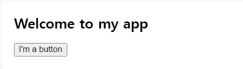

# :memo:Address0의 React 공부공간
### 2024-06-11 ~
## 목차
1. [1일차: React 정의 및 설치](#1일차-react-정의-및-설치)  
2. [2일차: DOM 작성](#2일차-dom-작성)
  - [컴포넌트](#컴포넌트)
  - [스타일 추가: `className`으로 css class지정](#스타일-추가-classname으로-css-class지정)
## 1일차: React 정의 및 설치
### :mag_right:React란?
**페이스북에서 개발한 오픈소스 라이브러리**  
- 사용자 인터페이스(UI) 구축에 사용
- 대규모 애플리케이션&데이터 잦은 변경에 높은 성능
- Vue와의 공통점: 컴포넌트 기반 아키텍처 사용 :arrow_forward: 높은 재사용성과 유지보수
- Vue와의 차이점: Vue는 프레임워크, React는 라이브러리 기반 개발 도구
### React 설치
명령어 및 설치 과정
1. `node.js` 및 npm 설치
- [Node.js](https://nodejs.org/en/) :arrow_forward: 해당 링크에서 LTS 설치 시 npm 함께 설치
2. `yarn` 설치
```bash
$ npm install --global yarn
```
3. CRA(Create-React-App)
```bash
$ npx create-next-app@latest
# 리액트 앱 생성한 폴더로 이동
$ cd firstapp
# 리액트 앱 시작
$ npm run dev
```
### :+1: Google 공식문서 활용 자습하기
- 참고링크: [React로 대화형 틱택토 구현하기](https://reactjs-kr.firebaseapp.com/tutorial/tutorial.html)
```bash
# React app 설치
$ npm install -g create-react-app
$ create-react-app firstapp
$ npm start
# 코드 초기화
$ cd my-app
$ rm -f src/*
```
## 2일차: DOM 작성
* 비고: npm업데이트 문제로 해결을 위해 npm cache app 설치됨
### 컴포넌트
- JSX 문법으로 작성(Javascript + return(HTML))
- 컴포넌트 이름은 항상 대문자로 시작
- HTML 태그는 소문자로 시작
- 컴포넌트 생성 및 중첩
- **하나의 컴포넌트는 여러 개의 JSX태드를 반환할 수 없다.**(`<div></div>` 또는 `<></>`부모로 감싸야 함)
```js
// 컴포넌트 생성
function MyButton() {
  return (
    <button>I'm a button</button>
  );
}
// 컴포넌트 중첩: MyApp 안에 MyButton 중첩하기
// export default: 파일의 기본 컴포넌트 지정
export default function MyApp() {
  return (
    <div>
      <h1>Welcome to my app</h1>
      <br />   
      {/* JSX: HTML과 달리 모든 태그를 닫아야 함 */}
      <MyButton />
    </div>
  );
}
```
- 출력 화면  

### 스타일 추가: `className`으로 css class지정
```js
function MyButton() {
  return (
    <button classname="avatar">I'm a button</button>
  );
}
```
```css
.avatar {
  border-radius: 50px;
}
```